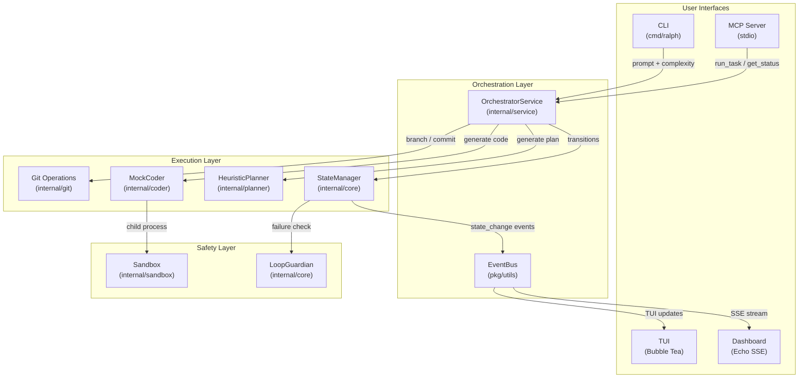

# Ralph2

**Autonomous AI coding orchestrator** — plan, build, and verify code changes with zero human intervention.

Ralph2 is a Go-based CLI that breaks a coding task into phases (Plan → Build → Verify), isolates work on Git branches, detects infinite loops, and exposes its state to IDEs via MCP and to browsers via SSE.

---

## Table of Contents

1. [Why Ralph2?](#why-ralph2)
2. [Getting Started](#getting-started)
3. [Commands & Workflows](#commands--workflows)
4. [Architecture](#architecture)
5. [Lifecycle Diagram](#lifecycle-diagram)
6. [Advanced Internals](#advanced-internals)
7. [Extending Ralph2](#extending-ralph2)
8. [Project Cleanup Log](#project-cleanup-log)

---

## Why Ralph2?

Most AI coding tools run in a single pass — prompt in, code out. Ralph2 adds **structure**:

- **Finite State Machine (FSM)** — Tasks move through `IDLE → PLANNING → BUILDING → VERIFYING → DONE` (or `FAILED`). No phase is skipped.
- **Git Isolation** — Every task runs on its own branch. If it fails, `main` stays clean.
- **Loop Detection** — The LoopGuardian catches repeated failures and breaks the cycle before it burns tokens.
- **Sandbox** — On Windows, child processes run inside a Job Object that limits CPU, memory, and prevents runaways.
- **Multi-Interface** — CLI, TUI (Bubble Tea), Web Dashboard (SSE), and MCP Server (for Cursor/Claude Code).

---

## Getting Started

### Prerequisites

| Tool | Version | How to check |
|------|---------|-------------|
| **Go** | 1.24+ | `go version` |
| **Git** | 2.x | `git --version` |

### Install & Build

```bash
git clone https://github.com/your-org/ralph2.git
cd ralph2
go build -o ralph2.exe ./cmd/ralph
```

### First Run

```bash
# Run a simple task
./ralph2.exe run --prompt "Create a hello world in Go" --complexity fast

# Start the TUI
./ralph2.exe tui

# Start the Web Dashboard
./ralph2.exe dashboard
# → Open http://localhost:8080 in your browser

# Start the MCP Server (for IDE integration)
./ralph2.exe mcp
```

### Complexity Modes

| Mode | When to use |
|------|-------------|
| `fast` | Quick scaffolding, single-file changes |
| `streamlined` | Default. Multi-file features with basic verification |
| `full` | Production features with thorough testing |

---

## Commands & Workflows

### `ralph2 run`

The core command. Accepts `--prompt` and `--complexity`.

```
ralph2 run --prompt "Add user authentication" --complexity streamlined
```

**What happens:**
1. Checks that your Git working tree is clean.
2. Creates a task branch (`ralph/task-*`).
3. Moves through Planning → Building → Verifying.
4. Commits results at each phase.

### `ralph2 tui`

Launches the Bubble Tea terminal UI. Shows FSM state and logs in real time.

### `ralph2 dashboard`

Starts an Echo web server on port 8080. The `/events` endpoint streams Server-Sent Events (SSE) for live FSM updates.

### `ralph2 mcp`

Starts a stdio-based MCP server. IDEs like Cursor or Claude Code can connect and use two tools:

| Tool | Description |
|------|-------------|
| `run_task` | Start a coding task (prompt + complexity) |
| `get_status` | Get current FSM state and complexity |

---

## Architecture

### Module Map

```
ralph2/
├── cmd/ralph/          # CLI entry points
│   ├── main.go         # Root command, flags
│   ├── run.go          # `run` subcommand → calls OrchestratorService
│   ├── tui.go          # `tui` subcommand → Bubble Tea
│   ├── dashboard.go    # `dashboard` subcommand → Echo SSE server
│   └── mcp.go          # `mcp` subcommand → MCP stdio server
│
├── internal/
│   ├── core/           # FSM (StateManager) + LoopGuardian
│   ├── planner/        # HeuristicPlanner → generates spec.md
│   ├── coder/          # MockCoder → generates code from spec
│   ├── git/            # Branch creation, dirty checks, commits
│   ├── sandbox/        # Windows Job Object process isolation
│   ├── service/        # OrchestratorService (shared by CLI + MCP)
│   ├── dashboard/      # Web dashboard (Echo + SSE)
│   ├── mcp/            # MCP server (metoro-io/mcp-golang)
│   └── tui/            # Bubble Tea model
│
├── pkg/utils/          # EventBus (pub/sub for cross-module events)
├── docs/               # lessons_learned.md
├── .goreleaser.yaml    # Automated release config
└── .github/workflows/  # CI: build + release on tag
```

### Component Diagram (Mermaid)



---

## Lifecycle Diagram

This diagram separates **user-driven** actions (blue) from **system/automated** processes (green).

```mermaid
sequenceDiagram
    actor User
    participant CLI as CLI / MCP
    participant SVC as OrchestratorService
    participant GIT as Git Module
    participant FSM as StateManager
    participant PLAN as HeuristicPlanner
    participant CODE as MockCoder
    participant LOOP as LoopGuardian
    participant BUS as EventBus
    participant DASH as Dashboard / TUI

    Note over User,CLI: 🔵 User-Driven
    User->>CLI: ralph2 run --prompt "..." --complexity fast
    CLI->>SVC: Run(prompt, complexity)

    Note over SVC,DASH: 🟢 System/Automated
    SVC->>GIT: CheckDirty()
    GIT-->>SVC: clean: true
    SVC->>GIT: CreateTaskBranch()
    GIT-->>SVC: branch: ralph/task-abc123

    SVC->>FSM: SetComplexity(fast)
    SVC->>FSM: TransitionTo(PLANNING)
    FSM->>BUS: Publish("state_change", PLANNING)
    BUS->>DASH: SSE: {"state": "PLANNING"}

    SVC->>PLAN: Plan(prompt)
    PLAN-->>SVC: spec.md generated
    SVC->>GIT: CommitChanges("docs: plan")

    SVC->>FSM: TransitionTo(BUILDING)
    FSM->>BUS: Publish("state_change", BUILDING)
    BUS->>DASH: SSE: {"state": "BUILDING"}

    SVC->>CODE: Build("spec.md")
    CODE-->>SVC: hello.go generated
    SVC->>GIT: CommitChanges("feat: implement")

    SVC->>FSM: TransitionTo(VERIFYING)
    FSM->>BUS: Publish("state_change", VERIFYING)
    BUS->>DASH: SSE: {"state": "VERIFYING"}

    SVC->>LOOP: RecordFailure(error)
    alt No Loop Detected
        LOOP-->>SVC: isLoop: false
        SVC->>FSM: TransitionTo(DONE)
        FSM->>BUS: Publish("state_change", DONE)
        BUS->>DASH: SSE: {"state": "DONE"}
    else Loop Detected
        LOOP-->>SVC: isLoop: true
        SVC->>FSM: TransitionTo(FAILED)
        FSM->>BUS: Publish("state_change", FAILED)
        BUS->>DASH: SSE: {"state": "FAILED"}
    end

    Note over User,CLI: 🔵 User-Driven
    CLI-->>User: Task completed / failed
```

---

## Advanced Internals

### Finite State Machine (FSM)

The `StateManager` in `internal/core/states.go` enforces valid transitions:

```
IDLE → PLANNING → BUILDING → VERIFYING → DONE
                                    ↓
                                  FAILED
```

Invalid transitions (e.g., `IDLE → VERIFYING`) are rejected with an error. Every transition publishes a `state_change` event on the `EventBus`.

### LoopGuardian

`internal/core/loopguardian.go` prevents infinite retry loops:

- **SHA-256 Hashing** — Each error message is normalized (lowercased, timestamps stripped) and hashed.
- **Threshold** — If the same hash appears 3 times within a window, a loop is declared.
- **Temperature Escalation** — On repeated but non-identical failures, the system can increase randomness (see `loop_mitigation.md`).

### EventBus

`pkg/utils/eventbus.go` provides a topic-based pub/sub system:

- `Subscribe(topic)` returns a buffered channel (capacity 10).
- `Publish(topic, payload)` sends non-blocking to all subscribers.
- `Unsubscribe(ch)` removes and closes the channel.

### Sandbox (Windows)

`internal/sandbox/jobobject.go` creates a Windows Job Object:

- Limits CPU time and memory for child processes.
- Prevents process escape via `JOB_OBJECT_LIMIT_KILL_ON_JOB_CLOSE`.
- Automatically terminates all children when the parent exits.

### MCP Server

Uses `metoro-io/mcp-golang` with stdio transport. Two tools are registered:

- **`run_task`** — Takes `prompt` (string) and `complexity` (string, default "streamlined"). Calls `OrchestratorService.Run()`.
- **`get_status`** — Returns current FSM state and complexity level.

### OrchestratorService

`internal/service/orchestrator.go` is the shared entry point for both CLI and MCP:

- Creates `EventBus` and `StateManager`.
- Exposes `Run(prompt, complexity)` which drives the full lifecycle.
- Separates "what to do" (service) from "how to invoke it" (CLI/MCP/TUI).

---

## Extending Ralph2

### Adding a New "Hat" (Agent)

1. Create a package under `internal/` (e.g., `internal/tester/`).
2. Implement a struct with a method like `Test(specPath string) error`.
3. Call it from `OrchestratorService.Run()` between the `BUILDING` and `VERIFYING` states.
4. Add a corresponding FSM state if needed (in `internal/core/states.go`).

### Adding a New MCP Tool

1. Open `internal/mcp/server.go`.
2. In `registerTools()`, add a new `s.mcp.RegisterTool(...)` call.
3. Define the args struct with `json` and `jsonschema` tags.
4. Return `mcp_sdk.NewToolResponse(mcp_sdk.NewTextContent(...))`.

### Adding a Dashboard Route

1. Open `internal/dashboard/server.go`.
2. Add a new route in `NewServer()` (e.g., `e.GET("/metrics", s.handleMetrics)`).
3. Implement the handler method on the `Server` struct.

---

## Project Cleanup Log

The following files were moved to `.archive/` (excluded from Git) because they are no longer needed for development:

| Archived Path | Original Location | Reason |
|---|---|---|
| `.archive/ralph.exe` | `ralph.exe` | Old binary (Feb 16), superseded by `ralph2.exe`. Name didn't match project. |
| `.archive/go.zip` | `go.zip` | 76 MB Go SDK installer. Go is already installed to `.loki/tools/go/`. Not a source file. |
| `.archive/spec.md` | `spec.md` | Generated stub — recreated fresh on every `ralph2 run`. Not source code. |
| `.archive/internal/server/` | `internal/server/` | Previous dashboard implementation (Story 3.2, iteration 1). Replaced by `internal/dashboard/` which is simpler and self-contained. |
| `.archive/web/` | `web/` (`fs.go` + `dist/index.html`) | Embedded asset system only imported by `internal/server/` (above). Zero consumers after archival. |
| `.archive/ide-metadata/` | `.claudecode/`, `.kilocode/`, `.kilocodemodes`, `.opencode/`, `.roo/` | IDE-specific metadata from various AI coding tools. Not part of the application. |
| `.archive/stray/~` | `~/` | Empty directory, likely created by a mistyped shell command. |

> **Note:** The `.archive/` directory is listed in `.gitignore` — it exists locally for reference but is never committed.

---

## License

MIT

---

*Built with Loki Mode 🚀 — autonomous AI orchestration.*
